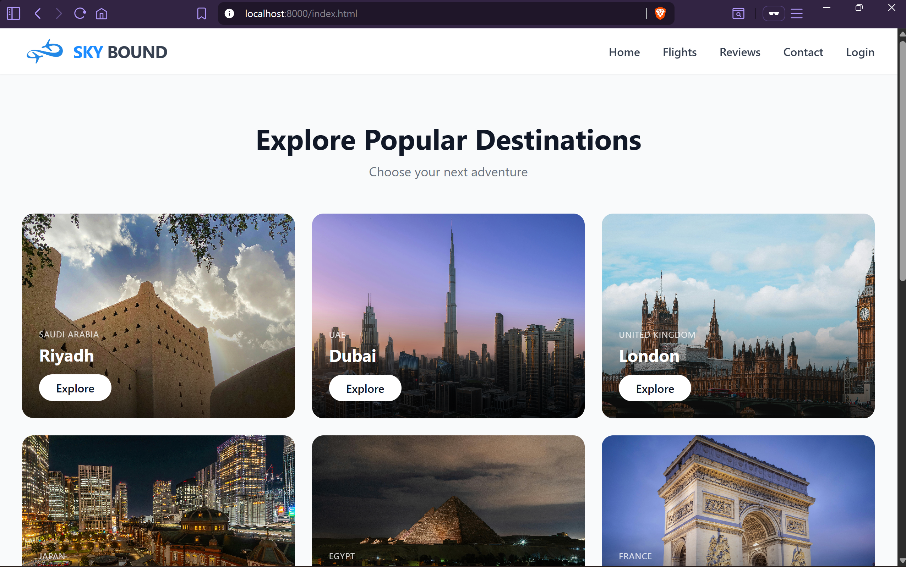
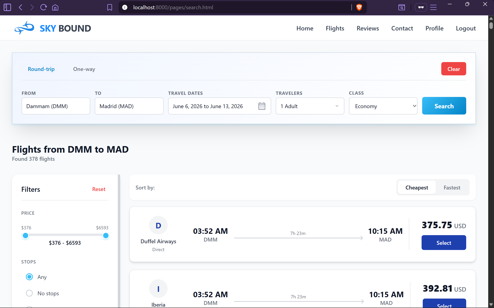
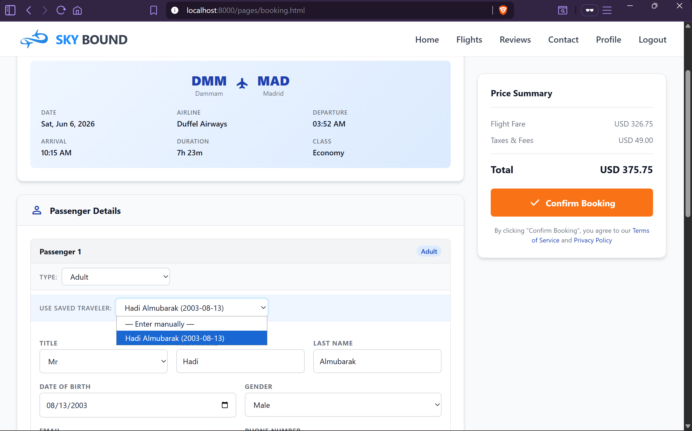
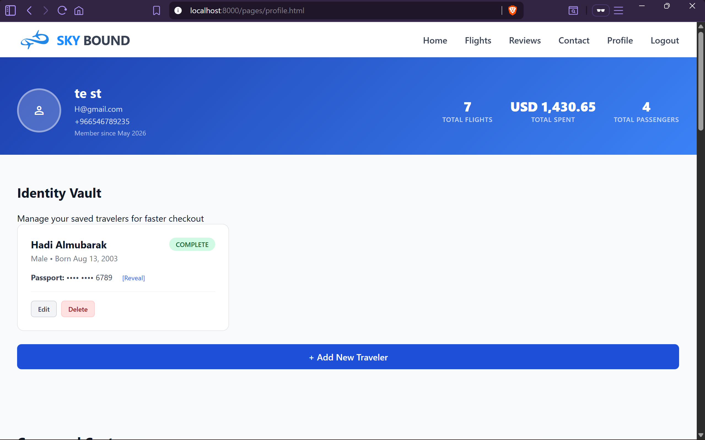
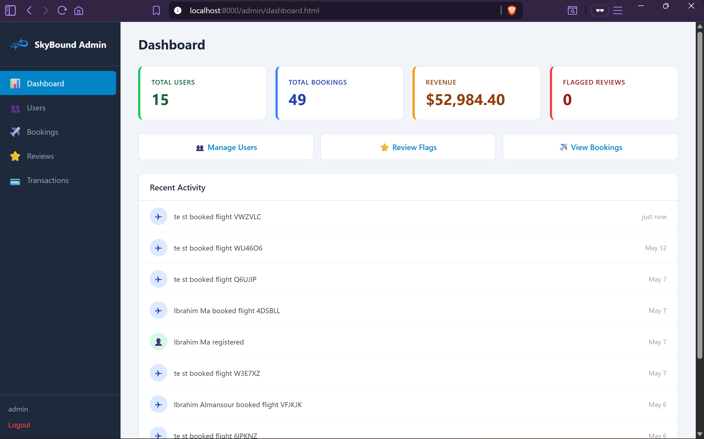
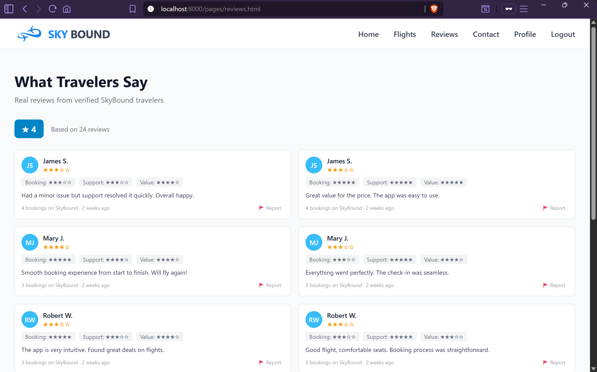

# SkyBound — Your Journey Begins Here

A full-stack airline ticket booking platform with real-time flight search, passenger management, secure booking, and smart cancellation with tiered refunds. Built with vanilla JavaScript, PHP, and MySQL — powered by the Duffel API.


---

## Screenshots

| Home Page | Flight Search | Booking Form |
|-----------|---------------|--------------|
|  |  |  |

| User Profile | Admin Dashboard | Reviews Page |
|--------------|-----------------|--------------|
|  |  |  |

---

## Features

### Flight Search
Real-time flight search via the Duffel API. Filter by airlines, number of stops, and price range. Sort by fastest flight or lowest price. Cabin class selection (economy, premium, business, first).

### Booking Flow
Enter passengers manually or quick-fill from saved traveler profiles. Add optional baggage and seat selection per passenger. Orders are created on Duffel and stored locally with a full flight snapshot for historical accuracy.

### User Profiles
Edit account settings (phone, password). Manage saved travelers with encrypted passport data — add, edit, or delete profiles for faster checkout. View complete booking history with status tracking.

### Cancellation & Refunds
Cancel bookings directly from your profile with a tiered refund policy:
- **7+ days** before departure: full refund
- **3–6 days** before departure: 50% refund
- **Under 3 days** before departure: no refund

All transactions (charges and refunds) are recorded in the transaction history.

### Reviews
Rate flights across 4 categories (overall, ease of booking, customer support, value for money) with 1–5 stars. Write comments (up to 1000 characters). Reviews can be flagged for moderation. Aggregated stats and top reviews displayed on the landing page.

### Admin Panel
Separate admin authentication with a full management dashboard:
- **Dashboard** — stats on users, bookings, revenue, and flagged reviews with a recent activity feed
- **Users** — searchable user list with booking counts
- **Bookings** — filter by status, cancel bookings (full refund at admin discretion)
- **Reviews** — review flagged reviews, publish or hide them
- **Transactions** — complete financial history

### Security
- **CSRF protection** on all state-changing endpoints
- **AES-256-CBC encryption** for passport data at rest
- **Bcrypt** password hashing
- **Security questions** for password recovery

---

## Tech Stack

| Layer | Technology |
|-------|-----------|
| Frontend | HTML5, CSS3, JavaScript (vanilla — no framework) |
| Backend | PHP 7.4+ (vanilla — no framework), PHP sessions |
| Database | MySQL via PDO |
| External API | Duffel API v2 (real-time flight data) |
| Security | CSRF tokens, AES-256-CBC, bcrypt |

---

## Standout Features

### Real-Time Flight API Integration
The Duffel API wrapper (`backend/lib/duffel.php`) handles the full flight search and booking lifecycle:
- **Offer requests** — search flights with origin, destination, dates, passengers, and cabin class
- **Service lookups** — fetch available baggage options and seat maps for each offer
- **Order creation** — create Duffel orders with passenger details, bag selection, and seat assignments

Flight data is snapshotted as JSON at booking time, so records remain accurate even if the API data changes later.

### Complete Booking Lifecycle
The entire booking journey is implemented end-to-end:

```
Search Flights → Select Offer → Add Passengers → Add Bags & Seats
     → Create Duffel Order → Store Locally → View in Profile
          → Cancel (with tiered refund) → Transaction Recorded
```

Every step persists real data — nothing is mocked. Passengers are stored as immutable snapshots at booking time, ensuring historical accuracy.

---

## Architecture

```
┌──────────────────────────────────────────────────┐
│                  FRONTEND (Browser)               │
│  ┌─────────────┐  ┌────────────┐  ┌───────────┐  │
│  │  HTML Pages │  │  CSS (7)   │  │ JS (17)   │  │
│  │  (13 files) │  │  files     │  │  files    │  │
│  └─────────────┘  └────────────┘  └───────────┘  │
│         │                │               │        │
│         └────────────────┼───────────────┘        │
│                          │ fetch()/AJAX           │
└──────────────────────────┼───────────────────────┘
                           │
┌──────────────────────────┼───────────────────────┐
│                  BACKEND (PHP)                    │
│  ┌─────────────────────────────────────────────┐ │
│  │            API Endpoints (28 files)          │ │
│  │  auth/ (7) | admin/ (8) | top-level (13)    │ │
│  └──────────────┬──────────────┬───────────────┘ │
│                 │              │                  │
│  ┌──────────────┴──┐  ┌───────┴──────────────┐  │
│  │  duffel.php     │  │  encryption.php      │  │
│  │  (Duffel API v2)│  │  (AES-256-CBC)       │  │
│  └─────────────────┘  └──────────────────────┘  │
│                 │                                │
│  ┌──────────────┴──────────────────────────────┐ │
│  │     db.php (MySQL via PDO)                  │ │
│  └──────────────┬──────────────────────────────┘ │
└─────────────────┼────────────────────────────────┘
                  │
┌─────────────────┼────────────────────────────────┐
│            MySQL Database                         │
│  7 tables: user, traveler_profile, booking,      │
│  passenger, transaction, review, admin_users      │
└──────────────────────────────────────────────────┘
                  │
┌─────────────────┼────────────────────────────────┐
│      Duffel API (External Service)                │
│  Flight search, offer details, order creation     │
└──────────────────────────────────────────────────┘
```

---

## Setup

### Prerequisites
- PHP 7.4+ with extensions: `pdo_mysql`, `openssl`, `curl`, `mbstring`
- MySQL / MariaDB
- A [Duffel](https://duffel.com) account (free sandbox available)

### Quick Start

1. **Clone and set up the database**
   ```bash
   git clone <your-repo-url> && cd Airline-Booking-Tickets
   mysql -u root -p < assets/db-schema.sql
   ```

2. **Configure the app**
   ```bash
   cp backend/config/config.example.php backend/config/config.php
   cp backend/config/db.example.php backend/config/db.php
   ```
   Edit `config.php` — add your Duffel API key and generate an encryption key:
   ```bash
   php -r "echo base64_encode(random_bytes(32));"
   ```
   Edit `db.php` — add your MySQL credentials.

3. **Create an admin user** (manual DB insert required)
   ```sql
   INSERT INTO admin_users (username, password_hash) VALUES ('admin', '<bcrypt-hash>');
   ```

4. **Run the server**
   ```bash
   php -S localhost:8000
   ```
   Open `http://localhost:8000`

---

## Database Schema

| Table | Purpose |
|-------|---------|
| `user` | Core accounts — name, email, phone, bcrypt password, security question |
| `traveler_profile` | Saved passenger identities — name, DOB, AES-256 encrypted passport |
| `booking` | Flight bookings — PNR, Duffel IDs, price, status, flight snapshot JSON |
| `passenger` | Immutable passenger snapshots at booking time — linked to booking |
| `transaction` | Financial records — charge/refund with status tracking |
| `review` | Platform reviews — 4 rating categories, comment, flagging support |
| `admin_users` | Separate admin accounts — username + bcrypt password |

---

## API Overview

| Group | Endpoints | Purpose |
|-------|-----------|---------|
| Auth | 7 | Login, register, logout, status, CSRF tokens, forgot/reset password |
| Flights & Booking | 4 | Search flights, get offer services, create booking, cancel booking |
| Profile | 3 | View profile/bookings/travelers, manage travelers (CRUD), update settings |
| Reviews | 1 | Full review CRUD, stats, and flagging |
| Admin | 7 | Admin auth, dashboard stats, user/booking/review/transaction management |
